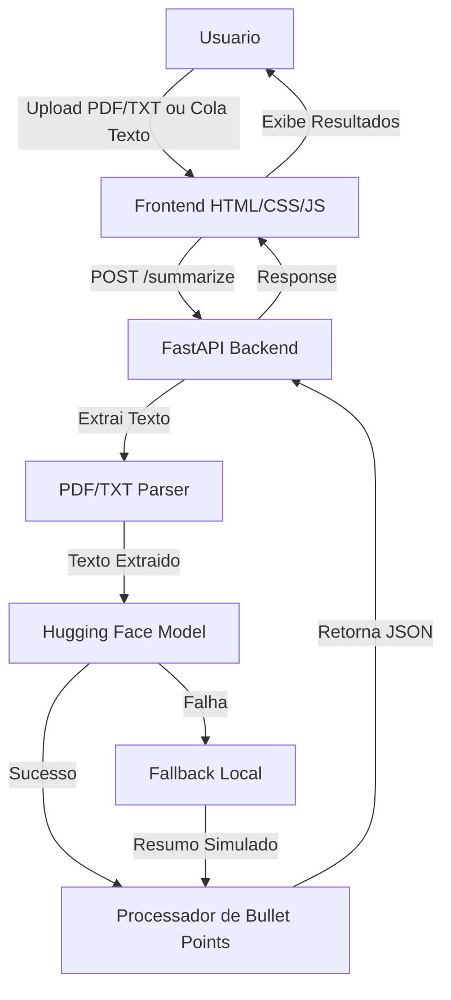

# 📋 Plano de Desenvolvimento - Aplicação de Resumo com IA

## 🎯 Objetivo
Criar uma aplicação web completa onde o usuário pode colar texto ou fazer upload de arquivo (PDF/TXT) e receber um resumo gerado por IA usando Hugging Face, com fallback local/simulado para garantir funcionamento em demonstrações.

## 🏗️ Arquitetura do Sistema



## 📁 Estrutura de Diretórios

```
text-summarizer/
├── backend/
│   ├── main.py              # FastAPI app principal
│   ├── summarizer.py        # Lógica de resumo com Hugging Face
│   ├── fallback_summarizer.py  # Resumidor local de backup
│   ├── pdf_extractor.py     # Extração de texto de PDF
│   └── requirements.txt     # Dependências Python
├── frontend/
│   ├── index.html           # Interface principal
│   ├── styles.css           # Estilos modernos
│   └── script.js            # Lógica do cliente
├── .gitignore
├── .env.example
└── README.md
```

## 🔧 Tecnologias e Bibliotecas

### Backend
- **FastAPI** - Framework web moderno e rápido
- **Uvicorn** - Servidor ASGI
- **PyPDF2** - Extração de texto de PDF
- **transformers** - Biblioteca Hugging Face
- **torch** - PyTorch para modelos de IA
- **python-multipart** - Upload de arquivos

### Frontend
- **HTML5** - Estrutura
- **CSS3** - Estilização moderna
- **JavaScript Vanilla** - Interatividade

### Modelo de IA
- **facebook/bart-large-cnn** - Modelo otimizado para resumos (principal)
- **Fallback Local** - Resumidor baseado em extração de sentenças (backup)

## 🎯 Funcionalidades Detalhadas

### 1. Upload de Arquivo
- Aceita PDF e TXT
- Validação de tipo e tamanho
- Feedback visual de progresso

### 2. Campo de Texto
- Área expansível para colar texto
- Limite de caracteres configurável
- Contador de palavras

### 3. Processamento
- Loading spinner animado
- Mensagens de status
- Tratamento de erros amigável
- **Fallback automático** se modelo principal falhar

### 4. Exibição de Resultados
- Resumo principal em destaque
- Lista de bullet points formatada
- Opção de copiar resultados
- Indicador de qual método foi usado (IA ou Fallback)

## ⚙️ Fluxo de Dados

1. **Input:** Usuário fornece texto via upload ou campo de texto
2. **Validação:** Backend valida formato e tamanho
3. **Extração:** Se PDF, extrai texto; se TXT, lê diretamente
4. **Processamento IA:** Tenta Hugging Face, usa fallback se falhar
5. **Bullet Points:** Extrai frases-chave do resumo
6. **Response:** Retorna JSON com summary e bullet_points
7. **Display:** Frontend exibe resultados formatados

## 🛡️ Tratamento de Erros

- Arquivo muito grande (>10MB)
- Formato não suportado
- PDF corrompido ou sem texto
- Texto muito curto (<50 caracteres)
- Erro no modelo de IA → **Usa fallback local**
- Timeout de processamento → **Usa fallback local**

## 📝 Endpoints da API

### POST /summarize
- **Content-Type:** multipart/form-data ou application/json
- **Body:** `{text: string}` ou `file: File`
- **Response:** `{summary: string, bullet_points: array, method: string}`

### GET /health
- Verifica status da API e modelo

## 🚀 Passos de Implementação

1. ✅ Criar estrutura de diretórios
2. ✅ Configurar backend FastAPI
3. ✅ Implementar extração de PDF
4. ✅ Integrar Hugging Face
5. ✅ **Criar fallback local/simulado**
6. ✅ Criar sistema de bullet points
7. ✅ Implementar tratamento de erros
8. ✅ Desenvolver frontend
9. ✅ Criar interface de upload
10. ✅ Implementar campo de texto
11. ✅ Adicionar loading
12. ✅ Criar área de resultados
13. ✅ Configurar CORS
14. ✅ Criar requirements.txt
15. ✅ Criar README.md
16. ✅ Adicionar .gitignore
17. ✅ Criar .env.example

## 📦 Dependências Python

```
fastapi==0.104.1
uvicorn[standard]==0.24.0
python-multipart==0.0.6
PyPDF2==3.0.1
transformers==4.35.2
torch==2.1.1
sentencepiece==0.1.99
```

## 🎨 Design do Frontend

- Interface limpa e moderna
- Responsivo para mobile
- Cores suaves e profissionais
- Animações sutis
- Feedback visual claro
- Badge indicando método usado (IA/Fallback)

## 🔄 Sistema de Fallback

O fallback local garante que a aplicação sempre funcione:

1. **Extração de Sentenças:** Divide texto em sentenças
2. **Pontuação:** Calcula importância baseada em:
   - Posição no texto
   - Comprimento da sentença
   - Palavras-chave
3. **Seleção:** Escolhe top 3-5 sentenças mais importantes
4. **Formatação:** Retorna como resumo coerente

## 📋 Instruções de Execução

### 1. Instalar dependências
```bash
cd backend
pip install -r requirements.txt
```

### 2. Iniciar backend
```bash
uvicorn main:app --reload --port 8000
```

### 3. Abrir frontend
```bash
cd frontend
# Abrir index.html no navegador
```

## ⚠️ Considerações

- Primeira execução com IA baixará o modelo (~1.6GB)
- Processamento IA: 5-30 segundos
- Processamento Fallback: <1 segundo
- Requer Python 3.8+
- Recomendado 8GB+ RAM para IA
- Fallback funciona com 2GB+ RAM